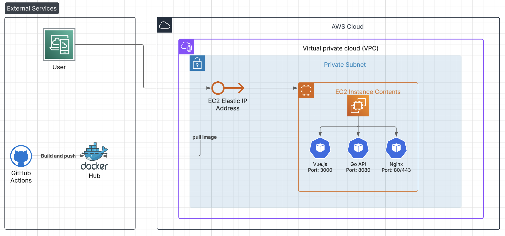

# Stock Analysis and Recommendation Platform

This is a full-stack application for retrieving, analyzing, and displaying stock market data. The project includes a Go backend, a Vue.js frontend, and a custom recommendation algorithm. The entire system is designed for automated deployment to AWS using Terraform, Ansible, and a GitHub Actions CI/CD pipeline.

## Features

-   **Data Ingestion**: Fetches stock data from the challenge API and enriches it with market data from the Alpha Vantage API.
-   **Backend API**: A backend built in Go serves data through a RESTful API.
-   **Frontend**: A frontend built with Vue 3, TypeScript, and Tailwind CSS V4, served via Nginx.
-   **Custom Recommendation Algorithm**: Provides "BUY", "HOLD", or "WATCH" recommendations based on a multi-factor scoring model.
-   **Infrastructure as Code (IaC)**: AWS infrastructure (VPC, EC2) is defined and managed with Terraform.
-   **Automated Provisioning**: The EC2 instance is configured using an Ansible playbook, which installs Nginx and the application.
-   **CI/CD Pipeline**: GitHub Actions are used for automated linting, testing, building, and deployment.

## Architecture

The application uses a decoupled architecture with a modern CI/CD pipeline and containerized deployment. Here's how the system works:



The architecture consists of three main layers:

1. **CI/CD Pipeline**: GitHub Actions automatically builds and pushes Docker images to Docker Hub when code is pushed to main branches
2. **AWS Infrastructure**: A single EC2 instance hosts all application components within a VPC
3. **Application Layer**: Three containerized services (Vue.js frontend, Go API backend, and Nginx reverse proxy) running on the EC2 instance

On the EC2 instance, Nginx acts as a web server for the Vue.js frontend files and as a reverse proxy for the Go backend API. The entire deployment process is automated through Infrastructure as Code (Terraform) and configuration management (Ansible).


## Tech Stack

-   **Backend**: Go 1.23
-   **Frontend**: Vue 3, TypeScript, Tailwind CSS v4, Pinia
-   **Web Server**: Nginx
-   **Database**: CockroachDB
-   **Infrastructure**: AWS (EC2, VPC)
-   **Deployment**: Terraform, Ansible, GitHub Actions

## API Endpoints

The backend exposes the following REST API endpoints:

### Health Check
- `GET /health`
  - Returns service health status.

### Stocks
- `GET /api/stocks`
  - Returns all stocks in the database.
  - Response: `{ stocks: [...], count: <number> }`

- `POST /api/stocks/sync`
  - Triggers a sync to fetch and store the latest stock data from the challenge API.
  - Response: `{ message: "Stocks synced successfully" }`

- `POST /api/stocks/enrich?limit=5`
  - Enriches stock data with additional market data from Alpha Vantage. Optional `limit` query param (default 5, max 20).
  - Response: `{ message: "Stock enrichment completed", stats: {...} }`

### Recommendations
- `GET /api/recommendations?limit=10`
  - Returns stock recommendations based on the scoring algorithm. Optional `limit` query param (default 10, max 50).
  - Response: List of recommended stocks with scores and recommendation labels.

## Recommendation Algorithm Explained

The recommendation algorithm in `recommendation_service.go` combines two data sources to generate a score for each stock.

### 1. Data Sources
1.  **Stored Stocks (Database)**: Historical analyst ratings and price targets.
2.  **Top Gainers (Alpha Vantage API)**: Real-time data on stocks with high daily price increases.

### 2. Scoring System
A stock's score is calculated using multiple factors.

#### A. Scoring for Database Stocks (Weighted System)
This score is a combination of three components:

1.  **Analyst Sentiment (40% Weight)**: Scores are assigned based on actions (`BUY`, `HOLD`, `SELL`). Rating upgrades increase the score, while downgrades decrease it. A bonus is added for ratings from reputable brokerage firms.
2.  **Fundamental Analysis (30% Weight)**: Points are awarded for low P/E ratios. Points are given if a stock is trading near its 52-week low. Market capitalization and positive earnings-per-share contribute to the score.
3.  **Price Target Analysis (30% Weight)**: The upside potential is calculated based on the difference between the analyst's target price and the current price. A higher upside results in a higher score.

#### B. Scoring for Top Gainers
This score is based on market momentum:
-   **Price Change**: The score is directly correlated with the stock's daily percentage gain.
-   **Volume Bonus**: Higher trading volume adds points, indicating stronger momentum.

### 3. Final Recommendation
Based on the final score, each stock receives a recommendation:

-   **Score ≥ 70**: **BUY**
-   **Score 50-69**: **HOLD**
-   **Score < 50**: **WATCH**

## How to Run

### Prerequisites

-   Go (version 1.23+)
-   Node.js (version 22+)
-   Docker
-   Terraform
-   Ansible
-   AWS account with configured credentials

### Local Development

1.  **Clone the repository:**
    `git clone <your-repo-url>`

2.  **Set up environment variables:**
    Create a `.env` file in the `backend` directory with the necessary API keys and the database connection string.

3.  **Run the Backend:**
    ```bash
    cd backend
    go mod tidy
    go run main.go
    ```

4.  **Run the Frontend:**
    ```bash
    cd frontend
    npm install
    npm run dev
    ```

### Deployment

The infrastructure and deployment are automated via the GitHub Actions pipeline defined in `.github/workflows/main.yml`. When code is pushed to the `main` branch, the pipeline will execute the following steps:
1.  Lint and test the backend code.
2.  Build the Go binary and frontend assets.
3.  Use Terraform to provision or update the AWS infrastructure.
4.  Run an Ansible playbook to configure the EC2 instance. This includes installing Nginx, setting it up to serve the frontend files, and deploying the backend application.

## Summary of Skills

This project demonstrates my ability to work across the full technology stack and learn new tools to meet project requirements.

My professional background is primarily in backend development (Go), cloud infrastructure (AWS), and DevOps (Terraform, Ansible). This project provided a practical opportunity to build a complete frontend application using Vue 3, a framework I had not used before. I successfully learned the framework and delivered a functional user interface connected to the backend API.

This shows my capacity to adapt to new technologies and take ownership of a project from end to end. I believe it is important to understand the entire system, from the UI to the infrastructure it runs on. For that reason, I implemented the IaC and CI/CD pipeline to create a reliable and automated process for testing and deployment.

## Personal Reflection on the Challenge

This project presented several interesting technical challenges that pushed me outside my comfort zone and provided valuable learning opportunities.

### Frontend Development with Vue.js

I had never worked with Vue.js before this project—I had only heard of it but never had the chance to dive deep into what it actually was. Coming from a React and Next.js background with components, hooks, and JSX, I initially experienced quite a paradigm shift when I started exploring Vue. The different approach to component structure and reactivity required some mental adjustment.

However, I found that Vue's template syntax and component organization felt surprisingly familiar to Django with Jinja templates, which I've worked with before. This similarity helped me understand Vue's concepts much faster than I initially expected. The declarative template syntax and the way Vue handles data binding reminded me of the patterns I was already comfortable with in Django's templating system.

### Backend Development with Go

While I had worked on small personal projects with Go before, this was my first time building a complete API from scratch. My previous backend experience spans Spring Boot, Node.js, Nest.js, and Python, so I had a good foundation to build upon.

What really impressed me about Go in this context was how straightforward and fast it was to work with. Unlike some experiences I've had with Java where you can run into head-scratching bugs related to framework complexities or dependency conflicts, Go felt remarkably clean and predictable. The language's simplicity and excellent standard library made it a pleasure to work with for building this type of API.

This experience has definitely convinced me to continue mastering Go and incorporating it into more projects going forward. The combination of performance, simplicity, and robust tooling makes it an excellent choice for backend services.

### Learning Approach and Methodology

Throughout this challenge, I relied heavily on official documentation rather than tutorials or external resources. This was particularly true for Vue 3, where I spent considerable time reading through the official Vue.js documentation to understand concepts like the Composition API, reactivity system, and component lifecycle. For Go, while I had some previous exposure, I still referenced the official Go documentation for best practices and standard library usage.

I've found that this documentation-first approach works exceptionally well for me because it keeps me more engaged and helps me develop a deeper understanding of the underlying concepts rather than just following along with someone else's implementation. This methodology has also served me well in my professional certifications, where I consistently rely on official documentation and specification materials to master new tools and concepts.

Reading technical documentation is something I genuinely enjoy and have extensive experience with through my certification journey. I find that taking the time to understand the "why" behind design decisions and architectural choices, rather than just the "how," makes me a more effective developer and helps me make better technical decisions in my own projects.

